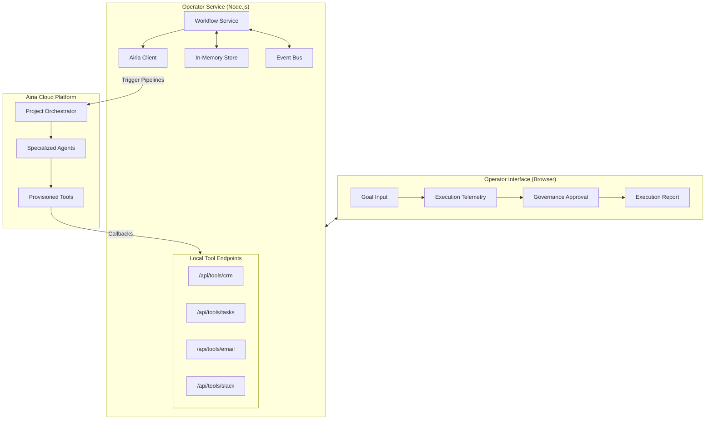

# Airia Autonomous Operator

Autonomous enterprise operator built on Airia's agent orchestration platform.

## Features

1. **Autonomous Provisioning**: Fully automated setup and configuration of agents and tools via the Airia API.
2. **Human-in-the-Loop Governance**: Secure orchestration with mandatory human approval for high-stakes actions.
3. **Observability**: Real-time visibility into agent-by-agent orchestration and decision-making.

## System Architecture

Airia Autonomous Operator is an enterprise-grade AI orchestration system built on top of the Airia platform. It translates high-level business goals into autonomous execution sequences across multiple specialized agents.



### Core Components

- **Operator Interface**: A real-time dashboard providing live telemetry of agent execution and mandatory governance checkpoints.
- **Workflow Service**: The central orchestrator that manages the multi-agent state machine and handles human-in-the-loop transitions.
- **Airia Cloud Integration**: Leverages Airia's agent-centric engine for specialized reasoning and tool execution.
- **Autonomous Agents**: 
    - **CRM Agent**: Retrieves and validates customer profiles.
    - **Docs Agent**: Generates structured onboarding assets.
    - **Ops Agent**: Manages internal task creation and resource allocation.
    - **Governance Agent**: Enforces enterprise safety and security policies.
    - **Comms Agent**: Executes professional external and internal communications.

### Autonomous Workflow

The system follows a deterministic orchestration path:
1. **Goal Interpretation**: Parsing the operational objective and identifying key parameters.
2. **Customer Intelligence**: Fetching data via specialized CRM tools.
3. **Asset Generation**: Creating plan-specific onboarding documentation.
4. **Operational Initialization**: Provisioning internal tasks for cross-functional teams.
5. **Governance Validation**: Evaluating outbound actions against safety rules.
6. **Human-in-the-Loop**: Mandatory pause for manual review of high-stakes communications.
7. **Execution & Dispatch**: Final delivery of assets and team notifications upon approval.
8. **Synthesis**: Comprehensive reporting of the entire execution trail.

## Quick Start

1. Install dependencies:

```bash
npm install
```

2. Configure environment variables:
   - Copy `.env.example` to `.env`.
   - Set `AIRIA_API_KEY`, `AIRIA_PROJECT_ID`, and `AIRIA_API_BASE_URL`.

3. Initialize and start the operator:

```bash
npm run operator:up
```

4. Access the operator interface:
   - Open `http://localhost:3000`.

## Operational Scripts

- `npm run operator:up`: Provision resources and start the operator.
- `npm run bootstrap`: Update or re-provision Airia resources.
- `npm run operator:reset`: Reset the local operational state.
- `npm run typecheck`: Perform static type analysis.

## Environment Configuration

- `PORT`: Port for the local operator service (default: 3000).
- `APP_BASE_URL`: Base URL where the operator is accessible.
- `AIRIA_API_BASE_URL`: Airia API base endpoint.
- `AIRIA_API_KEY`: Your Airia API key.
- `AIRIA_PROJECT_ID`: Target project ID for resource provisioning.

## API Architecture

The operator exposes endpoints for workflow management, tool interaction, and system maintenance:

- `POST /api/workflow/run`: Execute a new autonomous workflow.
- `GET /api/workflow/:id/stream`: Real-time SSE stream for execution events.
- `POST /api/workflow/approve`: Grant or deny approval for governed actions.
- `POST /api/system/reset`: Clear the current operational state.
